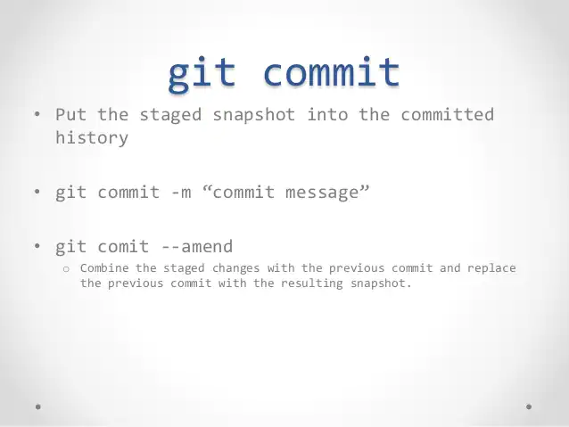

[< back](./readme.md)

## $ git commit

**$ git commit -m *"[сообщение с описанием]"*** - Фиксирует проиндексированные изменения и сохраняет их в историю версий

GIT Commit Cheat Sheet [by Adarsh Konchady](https://www.slideshare.net/AdarshKonchady/git-basic-commands)