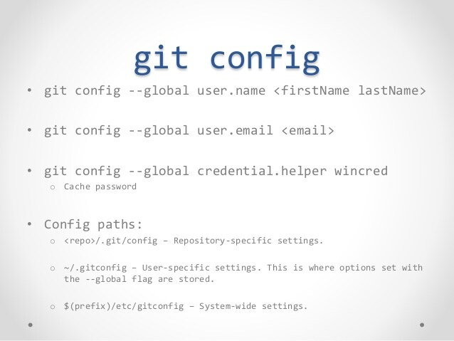

[< back](./readme.md)

## $ git config

**$ git config** - Настройка информации о пользователе для всех локальных репозиториев

**$ git config --global user.email *"[имя]"*** - Устанавливает имя, которое будет отображаться в поле автора у выполняемых вами коммитов

**$ git config --global user.email *"[адрес электронной почты]"*** - Устанавливает адрес электронной почты, который будет отображаться в информации о выполняемых вами коммитах

GIT Config Cheat Sheet [by Adarsh Konchady](https://www.slideshare.net/AdarshKonchady/git-basic-commands)