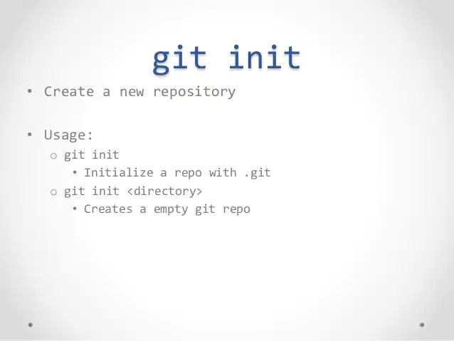

[< back](./readme.md)

## $ git init

**$ git init *[название проекта]*** - Создаёт новый локальный репозиторий с заданным именем

GIT Init Cheat Sheet [by Adarsh Konchady](https://www.slideshare.net/AdarshKonchady/git-basic-commands)